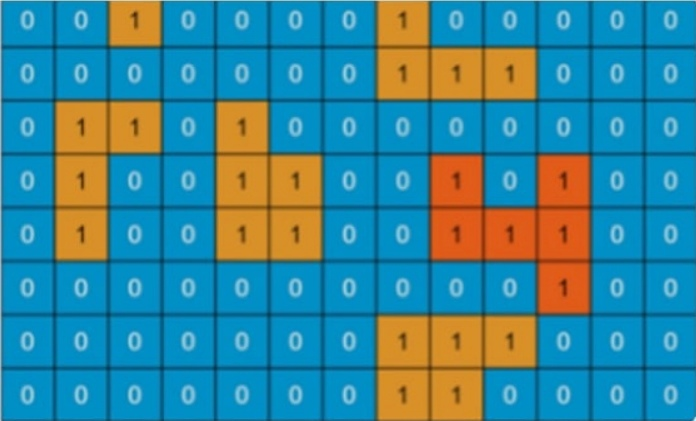

# RTSoft. Тестовое задание

## Условие
Написать программу, которая:
- Принимает на вход двумерный массив нулей и единиц определенного размера
- Определяет площадь острова максимального размера (в состав острова входят ячейки, содержащие 1, смежные по горизонтали или вертикали с ячейками, в которых 1)
- Алгоритм должен предусматривать возможность распараллеливания на несколько ядер процессора

## Пример

## Как запустить

## Пример выполнения

## Принцип работы